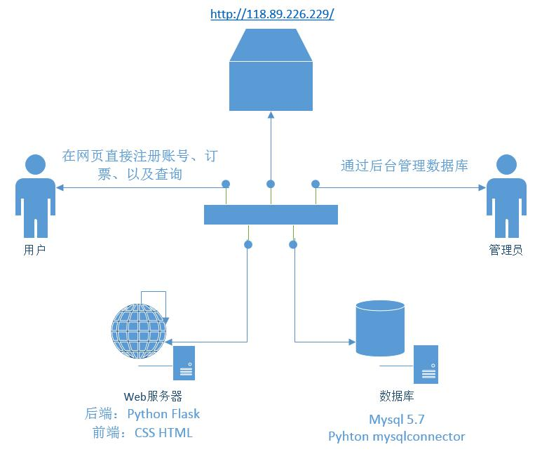

## 数据库课程设计——基于 Python Flask 的车站售票管理系统WEB设计

​	**注：服务器当时租用的是腾讯云，现已失效。**

## 1.Request请求处理

​	网站的页面交互请求的本质是 Request 请求，Request 请求可分为 Post 请求和 Get 请求。Flask 作为 Web 框架，使用路由（Route）实现URL的请求处理。下面介绍本网站程序主要有哪些请求处理。

### 1.1POST响应处理

​	本 WEB 程序涉及的 POST 请求处理有以下几个：

- 登录请求。登录页面需要用户输入用户名和密码，用户名不区分大小写，密码区分大小写。
  用户在订票和查询用户自身所订过的票前都需要登录。
- 注册请求。注册页面同样需要输入用户名和密码，用户名的字符串长度在 10 位以内，密码
  长度 20 位以内。用户的用户名在数据库中唯一。
- 订票界面，需要选定所有车次中的一种，按订票按钮即可实现订票。

### 1.2GET响应处理

​	本 WEB 程序设计的 GET 请求处理有以下几个：

- 登录。 
- 注册请求。
- 订单查询请求

------

## 2.MySQL数据库交互

​	Python 有多种方法与 MySQL 数据库实现交互。本 Web 网站使用的是 Python 的
MySQL Connector 模块连接 MySQL 数据库。
​	本 Web 网站涉及的 MySQL 操作如下：

- 查询车次情况。程序定义了一个查询车次情况的函数，使用 MySQL 的 select 语句从车次表
  中查询当前的车次信息。
- 登录判断。登录判断函数使用用户表中的数据，判断登录过程中的用户名和密码是否与数
  据库一致。
- 注册。注册函数使用 Insert 语句向用户表中插入用户注册所填的用户名和密码信息。注册
  函数提供几个异常处理，判断用户名和密码是否合法。
- 订票。订票函数会使用当前时间戳生成一个订单号（每秒最多生成 1000 个订单号），同时
  查询某个车次的座位情况，生成一个座位号，最后使用 Insert 语句将新的订单插入订单表。
- 用户订单查询。用户订单查询函数使用 select 语句查询某个用户的所有订单情况。
- 退票。退票函数使用 delete 语句从订单表中删除一个用户选择删除的订单。

------

## 3.前端页面渲染

​	Flask 使用 JinJa2 模版渲染生成 Html 等页面文件。本 Web 网站生成的 Html 文件主要有：

- ①home网站主页，提供车次的实时信息显示。
- ②form.html。该页面为登录、注册的页面。
  ③myorder.html。该页面为用户的订单示页面。
- ④signin-ok.html。用户登录成功后会显示 signin-ok 页面，显示车次的实时信息的同时提
  供订票选项和按钮。
- ⑤404.html。Flask 提供 errorhandler 函数实现发生错误跳转页面的支持。如果用户输入的
  地址非法，或进行非法数据操作，产生 400、404、405、500 错误，则统一显示网站的 404 页
  面。

